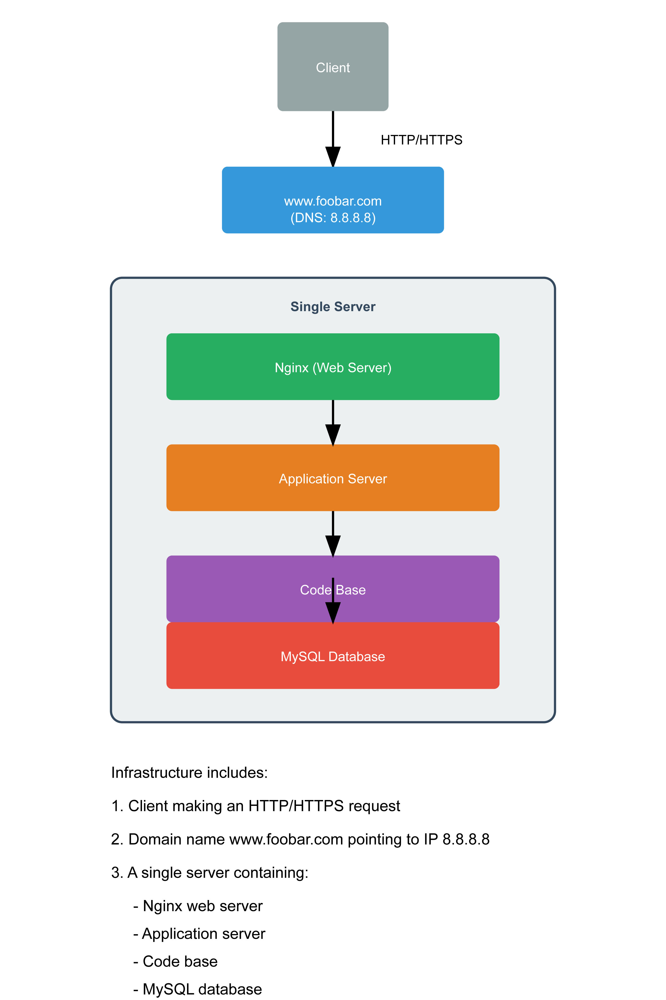

# 🌐 Web Infrastructure Design

## 📊 Simple Web Stack Diagram

## 🏗️ Architecture Description

This image represents a simple web stack architecture that illustrates the fundamental components of a web infrastructure:

### 🔍 Specifics of this Infrastructure

- **🖥️ Server**: Physical or virtual machine that hosts the applications and services needed to serve the website content.

- **🔤 Domain Name Role**: Provides a memorable address (www.foobar.com) that is translated to an IP address (e.g., 8.8.8.8) to locate the server on the Internet.

- **🔎 DNS Record Type for "www" in www.foobar.com**: "A" record (Address) that points to the server's IP address, or a CNAME record that points to another domain name.

- **🌐 Web Server Role (Nginx)**: Receives and processes HTTP requests, serves static files, and forwards dynamic requests to the application server.

- **⚙️ Application Server Role**: Executes the website code (e.g., PHP, Python, Ruby), processes business logic, and generates dynamic content.

- **💾 Database Role (MySQL)**: Stores and organizes data persistently, allowing for retrieval, updating, and manipulation of informatio

- **🔄 User Communication**: The server uses HTTP/HTTPS protocols to communicate with the user's computer requesting the website.

### ⚠️ Issues with this Infrastructure

- **🔌 SPOF (Single Point of Failure)**: All components are on a single server. If this server goes down, the entire site becomes inaccessible.

- **🛠️ Downtime during Maintenance**: When deploying new code or updates, the web server needs to be restarted, causing service interruption.

- **📈 Scaling Problems**: This architecture cannot easily adapt to handle a significant increase in incoming traffic because all resources are limited to a single server.
