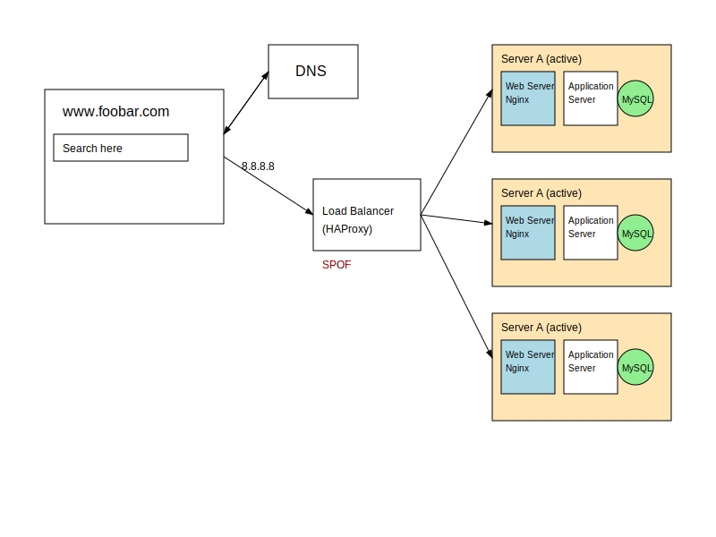

# 🌐 Distributed Web Infrastructure

## 📊 Distributed Web Stack Diagram

## 🏗️ Architecture Description

This diagram represents a distributed web infrastructure designed to serve the website www.foobar.com with improved reliability and performance compared to a simple web stack.

### 🔍 Additional Elements and Their Purpose

- **🔄 Load Balancer (HAproxy)**: Added to distribute incoming traffic across multiple servers, ensuring better resource utilization, preventing overload on any single server, and providing fault tolerance if one server fails.

- **🖥️ Additional Server**: Added to create redundancy, increase capacity, and eliminate the single point of failure that exists in a single-server setup. Having multiple servers allows for better handling of traffic spikes and maintenance without downtime.

- **💾 Database Primary-Replica Cluster**: Implemented to enhance data reliability, performance, and availability. The Primary-Replica setup allows for data replication, read scaling, and provides a backup mechanism.

### ⚙️ Load Balancer Configuration

- **🔀 Distribution Algorithm**: The HAproxy load balancer is configured with a Round Robin algorithm, which distributes requests sequentially to each server in rotation. This ensures an equal distribution of requests if servers have similar capabilities.

- **🔁 Active-Active vs. Active-Passive Setup**: Our load balancer enables an **Active-Active** setup where all servers actively receive and process requests simultaneously.
  - In **Active-Active**: All servers handle traffic concurrently, maximizing resource usage and throughput.
  - In **Active-Passive**: Only one server (active) handles all the traffic while others (passive) remain on standby, only becoming active if the primary server fails. This setup underutilizes resources but can be simpler to implement.

### 🗃️ Database Primary-Replica Cluster

- **🔄 How It Works**: In a Primary-Replica (Master-Slave) database cluster:
  - The Primary node (Master) handles all write operations.
  - The Primary node records all data changes in its binary log.
  - The Replica nodes (Slaves) copy and apply these logs to their own data.
  - This creates synchronized copies of the database across multiple servers.

- **⚖️ Primary vs. Replica Nodes**: 
  - The **Primary Node** handles all write operations (INSERT, UPDATE, DELETE) and data modifications.
  - The **Replica Node** primarily serves read operations, reducing the load on the Primary node.
  - From the application's perspective, write queries must be directed to the Primary, while read queries can be distributed between Primary and Replica nodes to balance the load.

### ⚠️ Issues with this Infrastructure

- **🔌 Single Points of Failure (SPOF)**:
  - The load balancer itself is a SPOF. If it fails, client requests cannot be distributed.
  - The Primary database node is a SPOF for write operations. If it fails, the application cannot modify data.
  - There's no redundancy for the load balancer or database primary.

- **🔒 Security Issues**:
  - **No Firewall**: The infrastructure lacks firewalls, making servers vulnerable to unauthorized access and potential attacks.
  - **No HTTPS**: Traffic is not encrypted, risking data exposure and man-in-the-middle attacks.
  - **No Authentication**: No mention of authentication mechanisms for accessing servers or databases.

- **📊 No Monitoring**: The infrastructure lacks monitoring solutions, making it difficult to:
  - Detect performance issues or failures before they affect users
  - Identify security breaches
  - Optimize resource usage based on traffic patterns
  - Plan capacity for future growth
  - Troubleshoot issues when they occur

A comprehensive monitoring solution would track server health, application performance, database metrics, and network traffic to ensure optimal operation and quick response to issues.