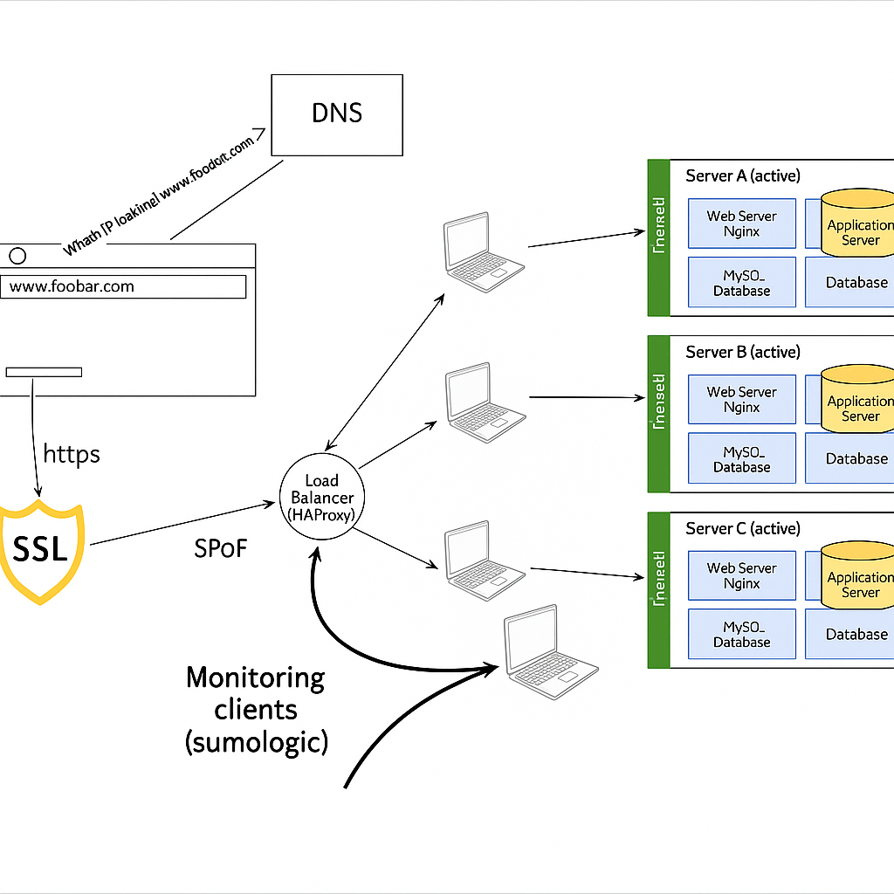

# 🛡️ Secured and Monitored Web Infrastructure

## 📊 Secured Web Stack Diagram

## 🏗️ Architecture Description

This diagram represents a secured and monitored web infrastructure designed to serve the website www.foobar.com with enhanced security, reliability, and observability compared to a basic distributed web stack.

### 🔍 Additional Elements and Their Purpose

- **🔒 Firewalls (3)**: Added to control and filter incoming and outgoing network traffic based on predetermined security rules. They create a barrier between our trusted internal network and untrusted external networks, preventing unauthorized access and protecting against various network threats.

- **🔐 SSL Certificate**: Implemented to enable HTTPS, which encrypts the traffic between clients and our servers. This prevents eavesdropping, man-in-the-middle attacks, and data tampering while providing authentication that ensures users are connecting to the legitimate website.

- **📡 Monitoring Clients (3)**: Deployed to collect performance data, logs, and metrics from all components of our infrastructure. These monitoring agents report to a monitoring service (like Sumologic or other SaaS monitoring platforms) that provides real-time insights into the health and performance of our systems.

### ⚙️ Load Balancer Configuration

- **🔀 Distribution Algorithm**: The HAproxy load balancer is configured with a Weighted Round Robin algorithm, which distributes requests sequentially to each server in rotation while taking into account server capacity. This ensures optimal distribution of requests based on each server's capabilities.

- **🔁 Active-Active Setup**: Our load balancer enables an **Active-Active** setup where all servers actively receive and process requests simultaneously.
  - In **Active-Active**: All servers handle traffic concurrently, maximizing resource usage and throughput.
  - In **Active-Passive**: Only one server (active) handles all the traffic while others (passive) remain on standby, only becoming active if the primary server fails. This setup underutilizes resources but can be simpler to implement.

### 🗃️ Database Primary-Replica Cluster

- **🔄 How It Works**: In a Primary-Replica (Master-Slave) database cluster:
  - The Primary node (Master) handles all write operations.
  - The Primary node records all data changes in its binary log.
  - The Replica nodes (Slaves) copy and apply these logs to their own data.
  - This creates synchronized copies of the database across multiple servers.

- **⚖️ Primary vs. Replica Nodes**: 
  - The **Primary Node** handles all write operations (INSERT, UPDATE, DELETE) and data modifications.
  - The **Replica Node** primarily serves read operations, reducing the load on the Primary node.
  - From the application's perspective, write queries must be directed to the Primary, while read queries can be distributed between Primary and Replica nodes to balance the load.

### 🔍 Monitoring

- **📊 Purpose**: Monitoring is used to track the performance, health, and security of all infrastructure components in real-time.

- **📈 What is Monitored**:
  - Server metrics: CPU, memory, disk usage, and network traffic
  - Application metrics: response times, error rates, and request volumes
  - Database metrics: query performance, connections, and replication lag
  - Security events: failed login attempts, unusual traffic patterns, and potential breaches
  - Network metrics: latency, packet loss, and throughput

- **⚠️ Monitoring Data Collection**: The monitoring clients collect data by:
  - Querying system APIs and services
  - Analyzing log files
  - Tracking network packets
  - Running health checks
  - This data is then transmitted to the monitoring service for analysis and alerting.

### ⚠️ Issues with this Infrastructure

- **🔌 Single Points of Failure (SPOF)**:
  - The load balancer remains a SPOF. If it fails, client requests cannot be distributed.
  - The Primary database node is still a SPOF for write operations.
  - No redundancy for each of the firewalls, making them potential SPOFs.

- **🔒 Security Issues**:
  - **Terminating SSL at the Load Balancer**: While we've added SSL, terminating it at the load balancer means internal traffic between the load balancer and web servers might still be unencrypted, creating a security vulnerability within our network.
  - **No Web Application Firewall**: The infrastructure lacks a dedicated WAF to protect against application-layer attacks like SQL injection, XSS, etc.
  - **No Data Encryption at Rest**: While data in transit is encrypted via HTTPS, there's no mention of encrypting stored data, leaving it vulnerable if physical access to the servers is compromised.

- **⚠️ Monitoring Challenges**:
  - **No Centralized Log Management**: While we have monitoring, without a proper log aggregation system, troubleshooting complex issues across multiple servers becomes difficult.
  - **Alert Fatigue**: Without proper tuning, monitoring systems can generate excessive alerts, leading to important issues being overlooked.
  - **Resource Overhead**: Monitoring agents consume system resources, which needs to be accounted for in capacity planning.

A comprehensive security and monitoring strategy should address these concerns while maintaining performance and reliability of the infrastructure.