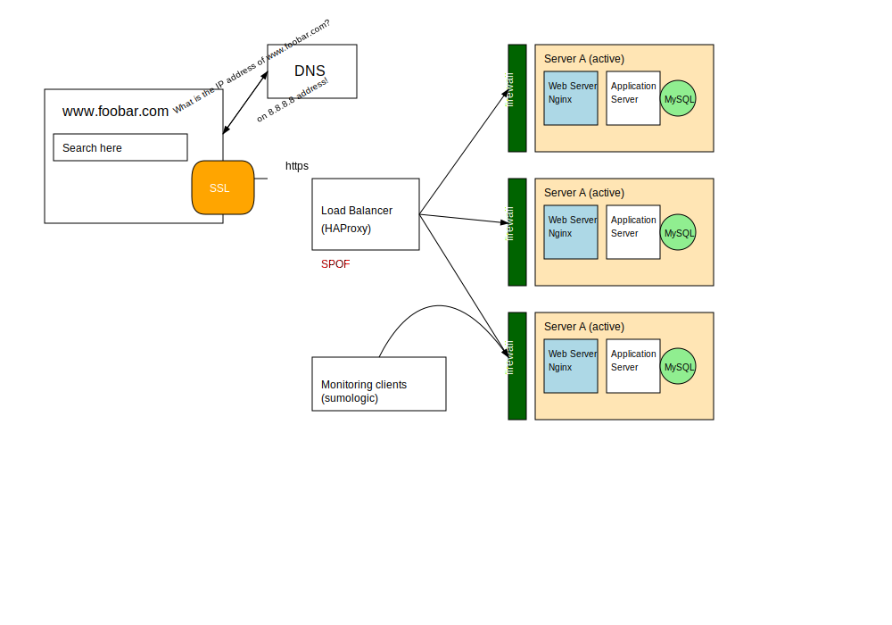

# 🚀 Scale Up Web Infrastructure

## 📊 Scale Up Architecture Diagram

## 🏗️ Architecture Description

This diagram represents a scaled-up web infrastructure designed to serve high-traffic websites with enhanced reliability, performance, and maintainability through proper component separation.

### 🔍 Additional Elements and Their Purpose

- **🔄 Additional Load Balancer**: Added to create a load balancer cluster that eliminates the load balancer as a single point of failure (SPOF). This setup provides high availability and fault tolerance for traffic distribution. If one load balancer fails, the other can take over seamlessly.

- **🖥️ Dedicated Web Server Servers**: Web server components (Nginx) have been separated onto their own dedicated servers to:
  - Improve resource allocation and prevent resource contention between different service types
  - Enable independent scaling of web server capacity based on specific traffic patterns
  - Allow for targeted optimization of server configurations for web serving tasks
  - Simplify maintenance and updates of web server components without affecting other services

- **⚙️ Dedicated Application Server Servers**: Application server components have been isolated onto dedicated servers to:
  - Provide focused resources for application code execution
  - Enable independent scaling of application processing capacity
  - Allow for targeted optimization of server environments for application workloads
  - Facilitate easier deployment of application updates without impacting web serving or database operations
  - Support better resource isolation for consistent application performance

- **💾 Dedicated Database Servers**: Database components have been moved to dedicated servers to:
  - Protect database performance from resource competition with web and application processes
  - Enable specialized hardware configurations optimized for database operations
  - Allow for independent scaling of database resources based on data growth and query complexity
  - Improve data security through physical isolation
  - Simplify backup and recovery processes

- **🔒 Split Components**: The overall strategy of splitting components across specialized servers provides several benefits:
  - **Scalability**: Each component can be scaled independently according to its specific resource needs
  - **Reliability**: Failure in one component is less likely to cascade to others
  - **Performance**: Resources can be optimized for each specific workload
  - **Security**: Better isolation between components reduces the attack surface
  - **Maintenance**: Updates and maintenance can be performed on specific components with minimal impact on others

### ⚙️ Load Balancers Configuration

The load balancers are configured in an Active-Active cluster setup, which provides:
- High availability with no single point of failure
- Continuous service even during maintenance of one load balancer
- Better distribution of the balancing workload itself
- Increased total throughput capacity for connection handling

This scaled-up architecture provides a solid foundation for high-traffic websites with room for future growth and expansion while maintaining reliability and performance.